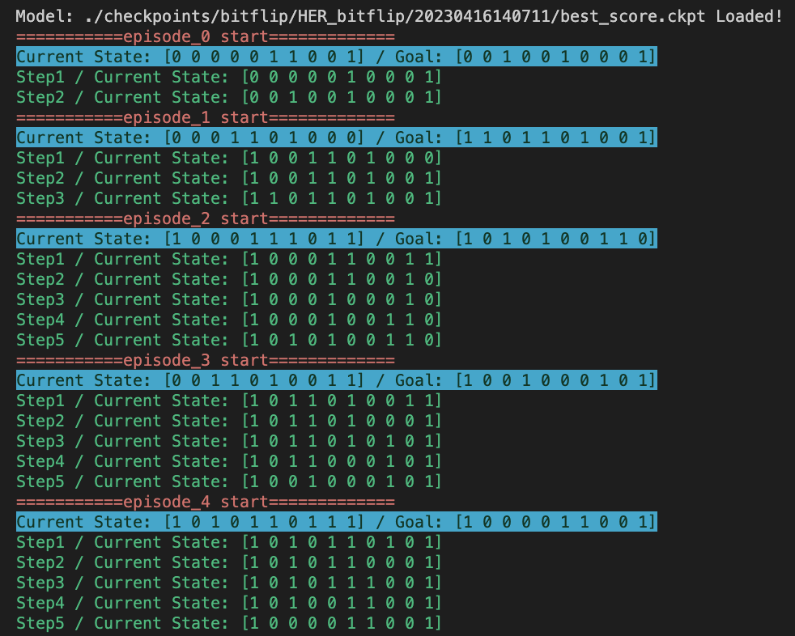

# Hindsight Experience Replay

This repository is the Pytorch implementation of [Hindsight Experience Replay](https://arxiv.org/abs/1707.01495)

---

## Pseudocode of the HER algorithm


---

## Set up

Install dependencies with Docker. You can also install dependencies using requirements.txt.

To build Docker image, run this command.
```
# format: docker build -t . <image_name>
docker build -t . her
```

After building image, use the following command to run the Docker container.
```
docker run -ti --gpus '"device='<gpu number>'"' -v <your working directory>:/app --ipc=host --name <container_name> <image_name> /bin/bash

# or you can run this command after changing docker_run.sh file in proper format
./docker_run.sh <gpu num> <container_name>
```
---

## Train
If you want to train the agent with HER algorithm in BitFlip environment, run this command inside the Docker container.
```
python train_bitflip.py --config config_bitflip.yaml
```

You can freely change the hyperparameter if you needed.

---
## Test

You can test with the pretrained network.
It can be downloaded in this [link](https://drive.google.com/file/d/1K15wejlYKXAqaF9QPDislfAzrY8BdiyI/view?usp=share_link)

To see the bitflip simulation result with the network, run
```
# before run this command, you should put the path to checkpoint in config file.
python render_bitflip.py --config config_bitflip.yaml
```

---
## Results

The bitflip simulation results with 10 bits.


The training logs of DDQN + HER.


The training logs of vanilla DDQN.


---
## Acknowlegement
1. https://github.com/hemilpanchiwala/Hindsight-Experience-Replay/tree/b79402af027cbd4321e4ae93aeefccdfd1b7d675
2. https://github.com/orrivlin/Hindsight-Experience-Replay---Bit-Flipping/tree/8f7920ee4ed5236f26549f2d62a760a537e6e6b4
3. https://towardsdatascience.com/hindsight-experience-replay-her-implementation-92eebab6f653
